# LISA: Reasoning Segmentation via Large Language Model
LISA: 基于大型语言模型的推理分割

<font size=4><div align='center'><b>LISA</b>：大型语言指导分割助手</div></font>

<font size=4><div align='center' > <a href=https://arxiv.org/pdf/2308.00692.pdf>**论文**</a> | <a href="https://huggingface.co/xinlai">**模型**</a> | [**训练**](#training) | [**推断**](#inference) | [**数据集**](#dataset) | <a href="http://103.170.5.190:7860/">**在线演示**</a></div></font>

<!-- <p align="center"> 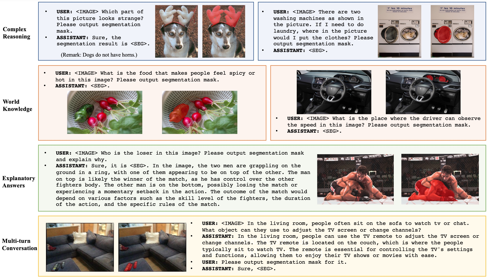 </p> -->

<table class="center">
<tr>
  <td style="text-align:center;"><b>输入</b></td>
  <td style="text-align:center;"><b>输出</b></td>
  <td style="text-align:center;"><b>输入</b></td>
  <td style="text-align:center;"><b>输出</b></td>
</tr>
<tr>
  <td></td>
  <td></td>
  <td>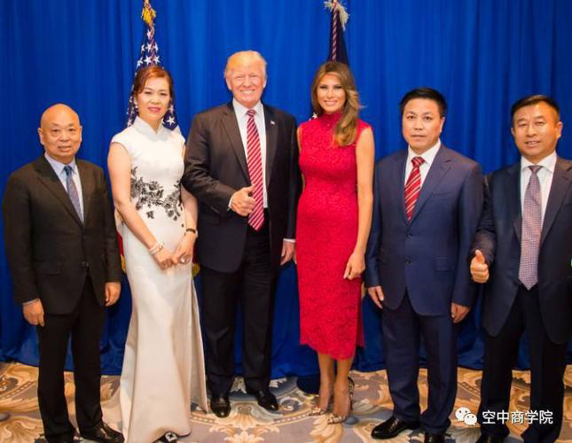</td>              
  <td>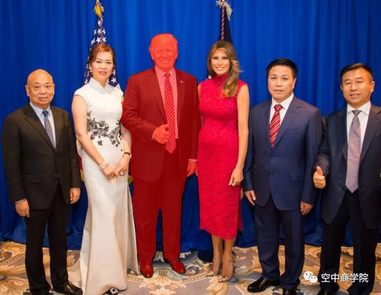</td>
</tr>
<tr>
  <td width=25% style="text-align:center;color:gray;">"Who was <ins>the president of the US</ins> in this image? Please output segmentation mask and explain the reason."</td>
  <td width=25% style="text-align:center;">"Sure, the segmentation result is [SEG]. The President of the United States in the image is <ins>President Obama.</ins>"</td>
  <td width=25% style="text-align:center;color:gray">"Who was <ins>the president of the US</ins> in this image? Please output segmentation mask and explain why."</td>
  <td width=25% style="text-align:center;">"Sure, [SEG]. In the image, the President of the United States is <ins>President Trump.</ins>"</td>
</tr>

<tr>
  <td></td>
  <td></td>
  <td>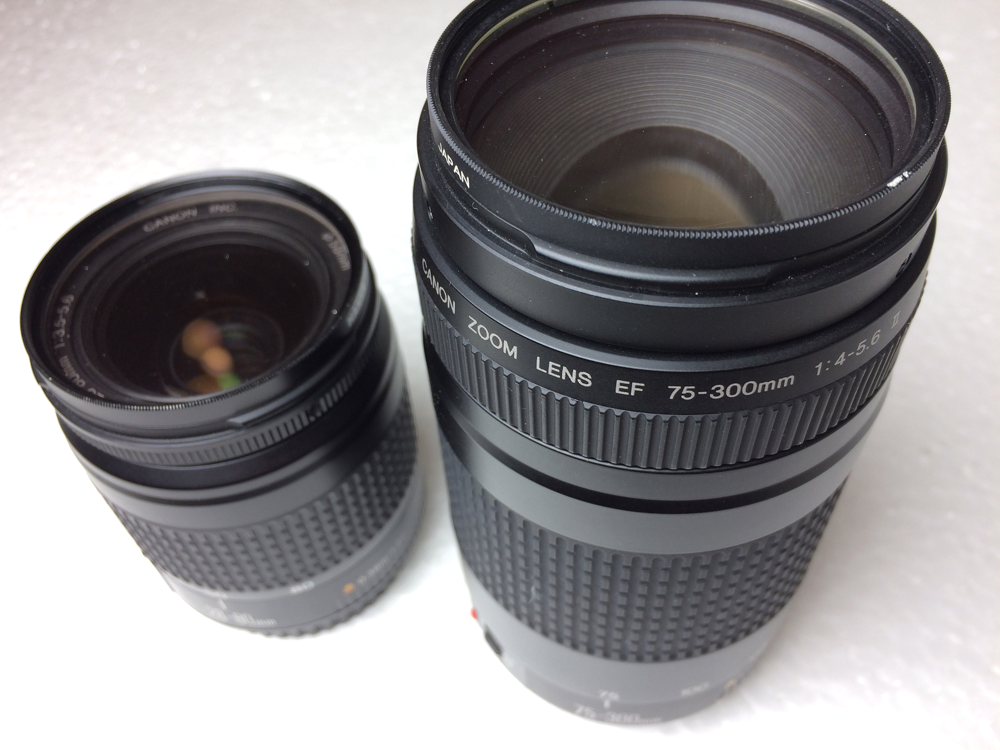</td>              
  <td>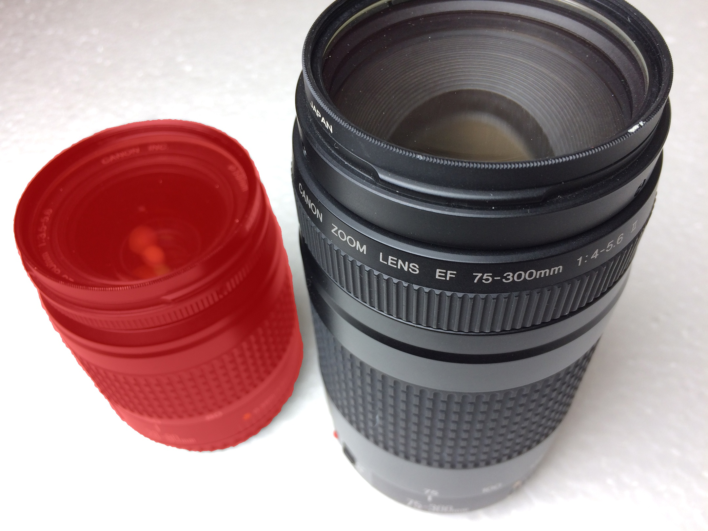</td>
</tr>
<tr>
  <td width=25% style="text-align:center;color:gray;">"What can <ins>make the woman stand higher</ins>? Please output segmentation mask and explain why."</td>
  <td width=25% style="text-align:center;">"Sure, [SEG]. The woman is <ins>standing higher by using a ladder</ins>..."</td>
  <td width=25% style="text-align:center;color:gray">"Can you segment <ins>the camera lens that is more suitable for photographing nearby objects</ins> in this image?"</td>
  <td width=25% style="text-align:center;">"Sure, [SEG]."</td>
</tr>

<tr>
  <td>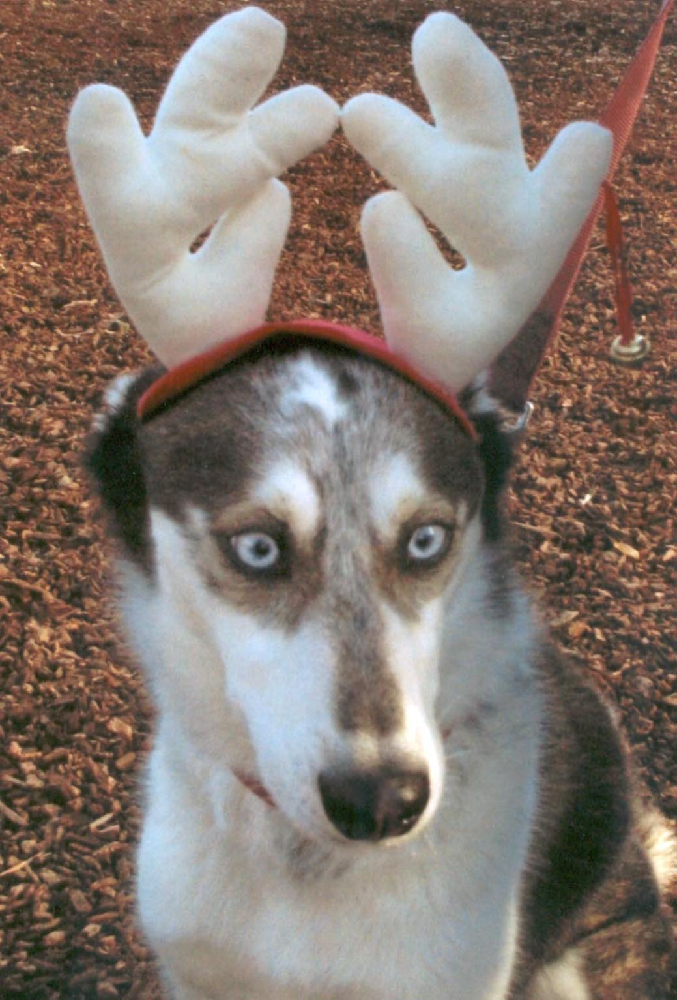</td>
  <td>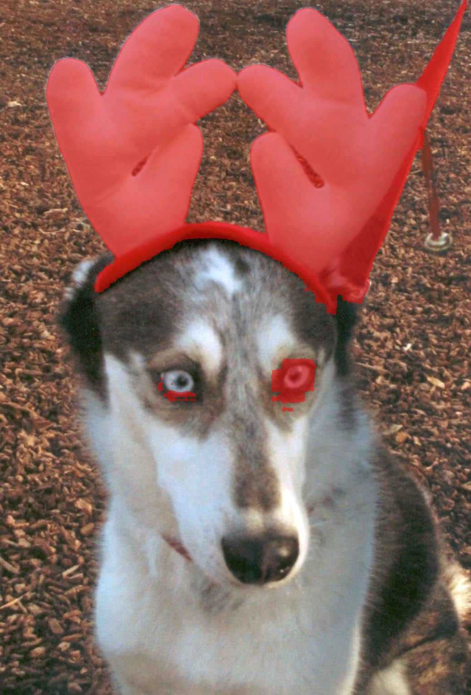</td>
  <td></td>              
  <td>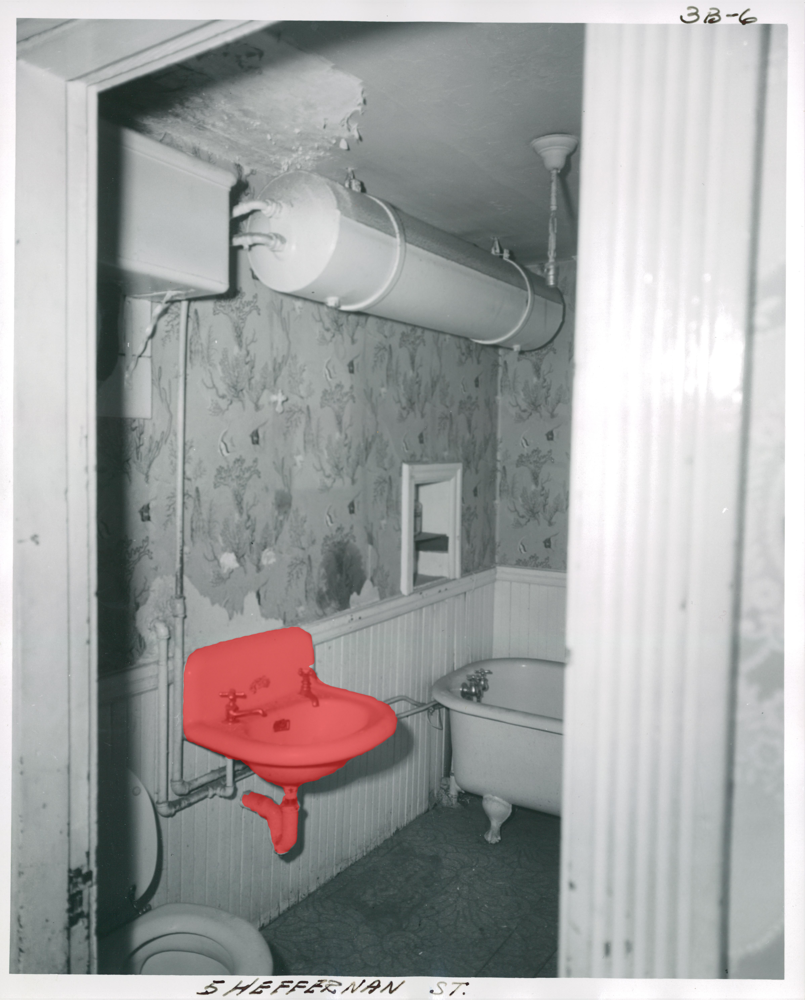</td>
</tr>
<tr>
  <td width=25% style="text-align:center;color:gray;">"Can you segment <ins>the unusual part</ins> in this image and explain why."</td>
  <td width=25% style="text-align:center;">"Sure, it is [SEG]. In the image, the unusual part is <ins>the dog wearing a reindeer antler headband</ins>..."</td>
  <td width=25% style="text-align:center;color:gray">"Where to <ins>wash hands</ins> in this image? Please output segmentation mask."</td>
  <td width=25% style="text-align:center;">"Sure, [SEG]."</td>
</tr>

<tr>
  <td>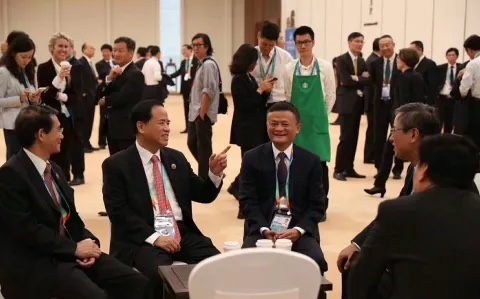</td>
  <td>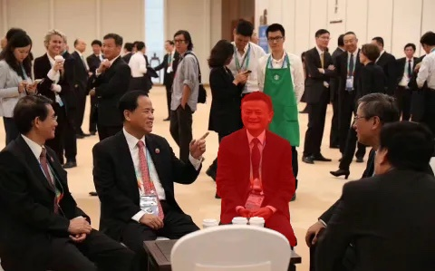</td>
  <td></td>              
  <td></td>
</tr>
<tr>
  <td width=25% style="text-align:center;color:gray;">"Can you segment <ins>the founder of Alibaba</ins> in this image and explain why?"</td>
  <td width=25% style="text-align:center;">"Sure, it is [SEG]. In the image, the man wearing a red tie and sitting on one of the chairs is <ins>Jack Ma</ins>, the co-founder of Alibaba Group..."</td>
  <td width=25% style="text-align:center;color:gray">"Please segment <ins>Lisa</ins> in this figure."</td>
  <td width=25% style="text-align:center;">"Sure, [SEG]."</td>
</tr>
</table>

<p align="center"> 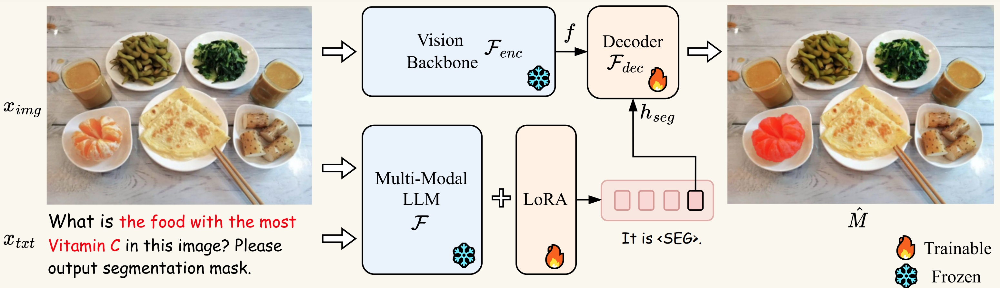 </p>

## 最新动态
- [x] [2023.8.9] 发布训练代码！
- [x] [2023.8.4] 发布[在线演示](http://103.170.5.190:7860/)！
- [x] [2023.8.4] 发布[*ReasonSeg* 数据集](https://drive.google.com/drive/folders/125mewyg5Ao6tZ3ZdJ-1-E3n04LGVELqy?usp=sharing) 和 [LISA-13B-llama2-v0-explanatory](https://huggingface.co/xinlai/LISA-13B-llama2-v0-explanatory) 模型！
- [x] [2023.8.3] 发布推断代码和 [LISA-13B-llama2-v0](https://huggingface.co/xinlai/LISA-13B-llama2-v0) 模型。欢迎查阅！
- [x] [2023.8.2] 发布[论文](https://arxiv.org/pdf/2308.00692.pdf)并创建了GitHub仓库。

**LISA:Reasoning Segmentation Via Large Language Model(基于大型语言模型的推理分割) [[论文](https://arxiv.org/abs/2308.00692)]** <br />
[Xin Lai](https://scholar.google.com/citations?user=tqNDPA4AAAAJ&hl=zh-CN),[Zhuotao Tian](https://scholar.google.com/citations?user=mEjhz-IAAAAJ&hl=en),[Yukang Chen](https://scholar.google.com/citations?user=6p0ygKUAAAAJ&hl=en),[Yanwei Li](https://scholar.google.com/citations?user=I-UCPPcAAAAJ&hl=zh-CN),[Yuhui Yuan](https://scholar.google.com/citations?user=PzyvzksAAAAJ&hl=en),[Shu Liu](https://scholar.google.com.hk/citations?user=BUEDUFkAAAAJ&hl=zh-CN),[Jiaya Jia](https://scholar.google.com/citations?user=XPAkzTEAAAAJ&hl=en)<br />

## 摘要
在这项工作中，我们提出了一个新的分割任务---***推理分割***。该任务旨在输出一个复杂和隐含的查询文本给定一个分割掩码。我们建立了一个包含一千多张图像-指令对的基准数据集，其中包含复杂的推理和世界知识以用于评估。最后，我们提出了 LISA：大型语言指导的分割助手，它继承了多模态大型语言模型（LLM）的语言生成能力，同时还具备生成分割掩码的能力。详情请参阅[论文](https://arxiv.org/abs/2308.00692)。

## 亮点
**LISA** 发掘了多模态LLM的新分割能力，并可以处理涉及以下情况的案例：
1. 复杂推理；
2. 通识；
3. 解释性答案；
4. 多轮对话。

**LISA** 还在仅在无推理数据集上训练的情况下展示了强大的zero-shot能力。此外，通过仅用239张推理分割图像-指令对对模型进行微调，进一步提升了性能。

## 实验结果
<p align="center"> 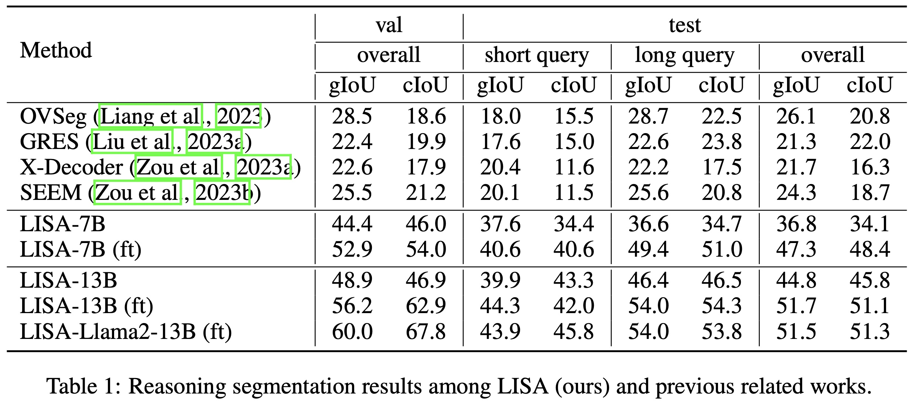 </p>

## 安装
```bash
pip install -r requirements.txt
pip install flash-attn --no-build-isolation
```

## 训练
### 训练数据准备
训练数据包括四种类型的数据：

1. 语义分割数据集：[ADE20K](http://data.csail.mit.edu/places/ADEchallenge/ADEChallengeData2016.zip)，[COCO-Stuff](http://calvin.inf.ed.ac.uk/wp-content/uploads/data/cocostuffdataset/stuffthingmaps_trainval2017.zip)，[Mapillary](https://www.mapillary.com/dataset/vistas)，[PACO-LVIS](https://github.com/facebookresearch/paco/tree/main#dataset-setup)，[PASCAL-Part](https://github.com/facebookresearch/VLPart/tree/main/datasets#pascal-part)，[COCO 图像](http://images.cocodataset.org/zips/train2017.zip)。

    注意：对于COCO-Stuff，我们使用标注文件 stuffthingmaps_trainval2017.zip。我们仅在PACO中使用PACO-LVIS部分。COCO 图像应放入 `dataset/coco/` 目录中。

3. 指称分割数据集：[refCOCO](https://web.archive.org/web/20220413011718/https://bvisionweb1.cs.unc.edu/licheng/referit/data/refcoco.zip)，[refCOCO+](https://web.archive.org/web/20220413011656/https://bvisionweb1.cs.unc.edu/licheng/referit/data/refcoco+.zip)，[refCOCOg](https://web.archive.org/web/20220413012904/https://bvisionweb1.cs.unc.edu/licheng/referit/data/refcocog.zip)，[refCLEF](https://web.archive.org/web/20220413011817/https://bvisionweb1.cs.unc.edu/licheng/referit/data/refclef.zip) ([saiapr_tc-12](https://web.archive.org/web/20220515000000/http://bvisionweb1.cs.unc.edu/licheng/referit/data/images/saiapr_tc-12.zip))。

    注意：refCOCO 系列数据的原始链接已失效，我们用新的链接更新了它们。

4. 视觉问答数据集：[LLaVA-Instruct-150k](https://huggingface.co/datasets/liuhaotian/LLaVA-Instruct-150K/blob/main/llava_instruct_150k.json)。

5. 推理分割数据集：[ReasonSeg](https://github.com/dvlab-research/LISA#dataset)。

从上面的链接下载它们，并组织如下。

```bash
├── dataset
│   ├── ade20k
│   │   ├── annotations
│   │   └── images
│   ├── coco
│   │   └── train2017
│   │       ├── 000000000009.jpg
│   │       └── ...
│   ├── cocostuff
│   │   └── train2017
│   │       ├── 000000000009.png
│   │       └── ...
│   ├── llava_dataset
│   │   └── llava_instruct_150k.json
│   ├── mapillary
│   │   ├── config_v2.0.json
│   │   ├── testing
│   │   ├── training
│   │   └── validation
│   ├── reason_seg
│   │   └── ReasonSeg
│   │       ├── train
│   │       ├── val
│   │       └── explanatory
│   ├── refer_seg
│   │   ├── images
│   │   |   ├── saiapr_tc-12 
│   │   |   └── mscoco
│   │   |       └── images
│   │   |           └── train2014
│   │   ├── refclef
│   │   ├── refcoco
│   │   ├── refcoco+
│   │   └── refcocog
│   └── vlpart
│       ├── paco
│       │   └── annotations
│       └── pascal_part
│           ├── train.json
│           └── VOCdevkit
```

### 预训练权重

#### LLaVA
要训练 LISA-7B 或 13B，您需要按照[说明](https://github.com/haotian-liu/LLaVA/blob/main/docs/MODEL_ZOO.md)合并 LLaVA 的 delta 权重。通常情况下，我们使用从 `liuhaotian/LLaVA-Lightning-7B-delta-v1-1` 和 `liuhaotian/LLaVA-13b-delta-v1-1` 合并的最终权重 `LLaVA-Lightning-7B-v1-1` 和 `LLaVA-13B-v1-1`。对于 Llama2，我们可以直接使用 LLaVA 的完整权重 `liuhaotian/llava-llama-2-13b-chat-lightning-preview`。

#### SAM ViT-H 权重
从[链接](https://dl.fbaipublicfiles.com/segment_anything/sam_vit_h_4b8939.pth)下载 SAM ViT-H 的预训练权重。

### 训练
```bash
deepspeed --master_port=24999 train.py \
  --version="PATH_TO_LLaVA" \
  --dataset_dir='./dataset' \
  --vision_pretrained="PATH_TO_SAM" \
  --dataset="sem_seg||refer_seg||vqa||reason_seg" \
  --sample_rates="9,3,3,1" \
  --exp_name="lisa-7b"
```
当训练完成后，要获取完整的模型权重：
```bash
cd ./runs/lisa-7b/ckpt_model && python zero_to_fp32.py . ../pytorch_model.bin
```

### 验证
```bash
deepspeed --master_port=24999 train.py \
  --version="PATH_TO_LLaVA" \
  --dataset_dir='./dataset' \
  --vision_pretrained="PATH_TO_SAM" \
  --exp_name="lisa-7b" \
  --weight='PATH_TO_pytorch_model.bin' \
  --eval_only
```

## 推断 
与 [LISA-13B-llama2-v0](https://huggingface.co/xinlai/LISA-13B-llama2-v0) 或 [LISA-13B-llama2-v0-explanatory](https://huggingface.co/xinlai/LISA-13B-llama2-v0-explanatory) 进行交流：（注意，LISA-13B-llama2-v0 目前不支持解释性答案。）
```bash
CUDA_VISIBLE_DEVICES=0 python3 chat.py --version='xinlai/LISA-13B-llama2-v0'
CUDA_VISIBLE_DEVICES=0 python3 chat.py --version='xinlai/LISA-13B-llama2-v0-explanatory'
```
要在推断中使用 `bf16` 或 `fp16` 数据类型：
```bash
CUDA_VISIBLE_DEVICES=0 python3 chat.py --version='xinlai/LISA-13B-llama2-v0' --precision='bf16'
```
要在推断中使用 `8bit` 或 `4bit` 数据类型（这样可以在单个 24G 或 12G GPU 上运行13B模型，但会牺牲一些生成质量）：
```bash
CUDA_VISIBLE_DEVICES=0 python3 chat.py --version='xinlai/LISA-13B-llama2-v0' --precision='fp16' --load_in_8bit
CUDA_VISIBLE_DEVICES=0 python3 chat.py --version='xinlai/LISA-13B-llama2-v0' --precision='fp16' --load_in_4bit
```

然后，输入文本提示，然后输入图像路径。例如，
```bash
- Please input your prompt: Where can the driver see the car speed in this image? Please output segmentation mask.
- Please input the image path：assets/images/example1.jpg

- Please input your prompt: Can you segment the food that tastes spicy and hot?
- Please input the image path：assets/images/example2.jpg
```
结果应该如下所示：
<p align="center"> 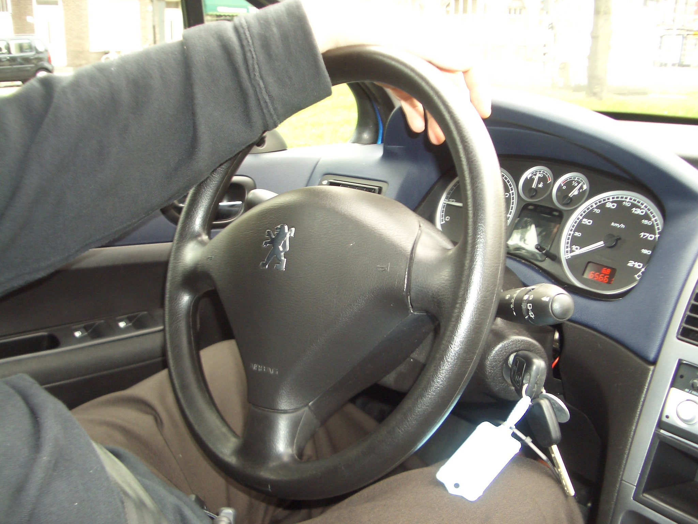 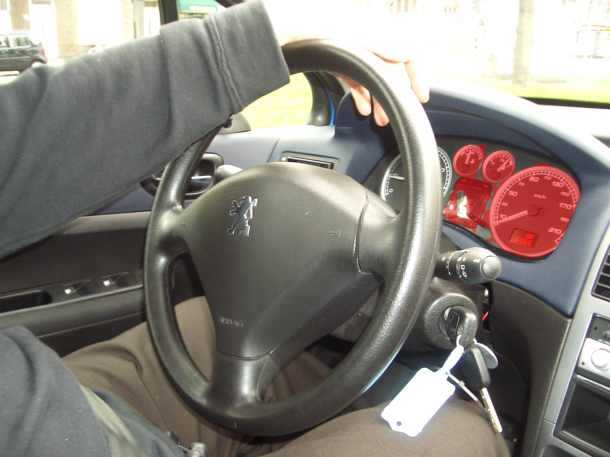  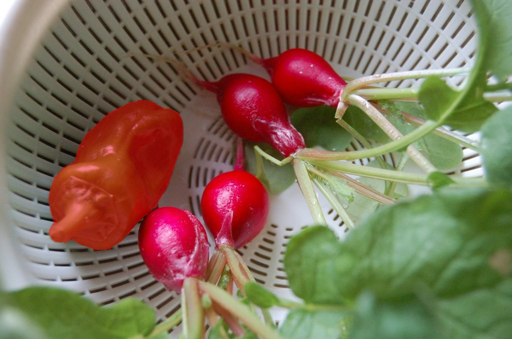 </p>

## 数据集
在 ReasonSeg 中，我们收集了1218张图片（239张训练、200张验证和779张测试）。训练和验证集可以从<a href="https://drive.google.com/drive/folders/125mewyg5Ao6tZ3ZdJ-1-E3n04LGVELqy?usp=sharing">**这个链接**</a>下载。

每张图片都附带一个注释 JSON 文件：
```
image_1.jpg, image_1.json
image_2.jpg, image_2.json
...
image_n.jpg, image_n.json
```
JSON 文件中包含的重要键：
```
- "text"：文本指令。
- "is_sentence"：文本指令是否为长句子。
- "shapes"：目标多边形。
```

"shapes" 的元素包括两个类别，即 **"target"** 和 **"ignore"**。前者是评估过程中必不可少的，而后者表示模糊区域，因此在评估过程中被忽略。

我们提供了一个<a href="https://github.com/dvlab-research/LISA/blob/main/utils/data_processing.py">**script**</a>来展示如何处理标注。
```python
python utils/data_processing.py
```
此外，我们还利用了 GPT-3.5 对指令进行了重新表述，因此训练集中的图像可能在 "text" 字段中具有一个以上的指令（但少于六个）。在训练过程中，用户可以随机选择一个作为文本查询，以获得更好的模型。

