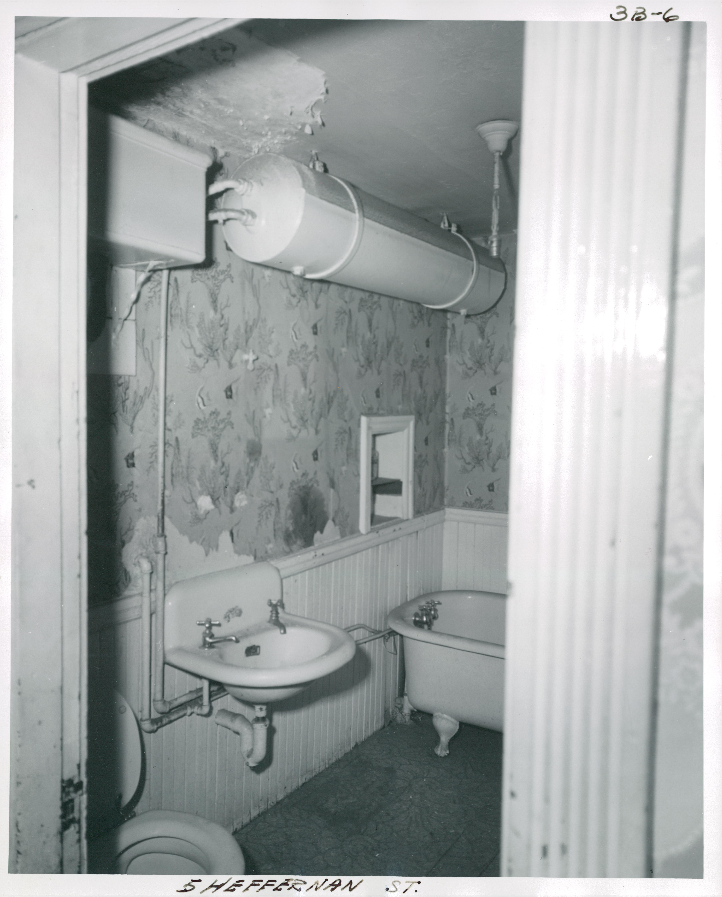
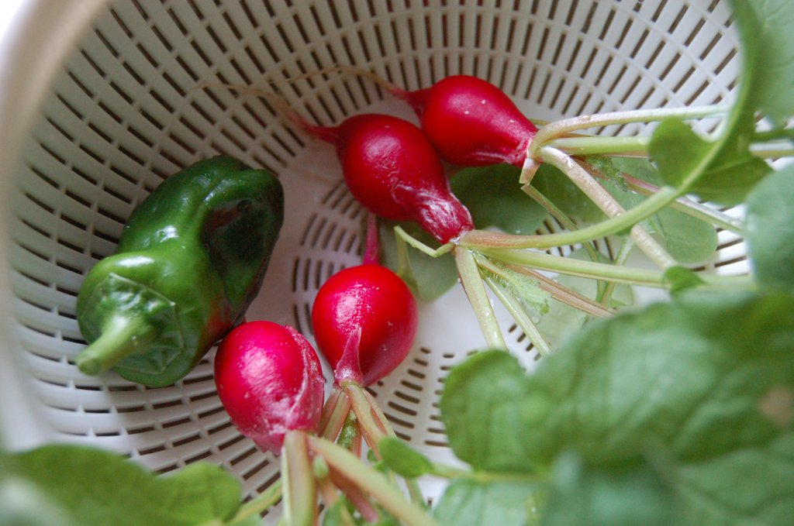

# LISA: 基于大型语言模型的推理分割

<font size=4><div align='center'><b>LISA</b>：大型语言指导分割助手</div></font>

<font size=4><div align='center' > <a href=https://arxiv.org/pdf/2308.00692.pdf>**论文**</a> | <a href="https://huggingface.co/xinlai">**模型**</a> | [**训练**](#training) | [**推断**](#inference) | [**数据集**](#dataset) | <a href="http://103.170.5.190:7860/">**在线演示**</a></div></font>

<!-- <p align="center">  </p> -->

<table class="center">
<tr>
  <td style="text-align:center;"><b>输入</b></td>
  <td style="text-align:center;"><b>输出</b></td>
  <td style="text-align:center;"><b>输入</b></td>
  <td style="text-align:center;"><b>输出</b></td>
</tr>
<tr>
  <td></td>
  <td></td>
  <td></td>              
  <td></td>
</tr>
<tr>
  <td width=25% style="text-align:center;color:gray;">"这张图中是谁担任了美国总统？请输出分割掩码并解释原因。"</td>
  <td width=25% style="text-align:center;">"当然，分割结果是[SEG]。图像中担任美国总统的是<ins>奥巴马总统。</ins>”</td>
  <td width=25% style="text-align:center;color:gray">"这张图中是谁担任了美国总统？请输出分割掩码并解释原因。"</td>
  <td width=25% style="text-align:center;">"当然，[SEG]。图像中担任美国总统的是<ins>特朗普总统。</ins>"</td>
</tr>

<tr>
  <td></td>
  <td></td>
  <td></td>              
  <td></td>
</tr>
<tr>
  <td width=25% style="text-align:center;color:gray;">"是什么让<ins>女人站得更高</ins>？请输出分割掩码并解释原因。"</td>
  <td width=25% style="text-align:center;">"当然，[SEG]。女人<ins>通过使用梯子站得更高</ins>..."</td>
  <td width=25% style="text-align:center;color:gray">"能够在这张图中分割适用于拍摄近距离物体的<ins>相机镜头</ins>吗？"</td>
  <td width=25% style="text-align:center;">"当然，[SEG]。"</td>
</tr>

<tr>
  <td></td>
  <td></td>
  <td></td>              
  <td></td>
</tr>
<tr>
  <td width=25% style="text-align:center;color:gray;">"能够分割出这张图中的<ins>异常部分</ins>并解释原因吗。"</td>
  <td width=25% style="text-align:center;">"当然，这是[SEG]。图像中的异常部分是<ins>戴着驯鹿鹿角头饰的狗</ins>..."</td>
  <td width=25% style="text-align:center;color:gray">"在这张图中，<ins>在哪里可以洗手</ins>？请输出分割掩码。"</td>
  <td width=25% style="text-align:center;">"当然，[SEG]。"</td>
</tr>

<tr>
  <td></td>
  <td></td>
  <td></td>              
  <td></td>
</tr>
<tr>
  <td width=25% style="text-align:center;color:gray;">"能够在这张图中分割出<ins>阿里巴巴的创始人</ins>并解释原因吗？"</td>
  <td width=25% style="text-align:center;">"当然，这是[SEG]。图像中穿着红领带，坐在椅子上的人是<ins>马云</ins>，阿里巴巴集团的联合创始人..."</td>
  <td width=25% style="text-align:center;color:gray">"请在这张图中分割<ins>莉莎</ins>。"</td>
  <td width=25% style="text-align:center;">"当然，[SEG]。"</td>
</tr>
</table>

<p align="center">  </p>

## 最新动态
- [x] [2023.8.9] 发布训练代码！
- [x] [2023.8.4] 发布[在线演示](http://103.170.5.190:7860/)！
- [x] [2023.8.4] 发布[*ReasonSeg* 数据集](https://drive.google.com/drive/folders/125mewyg5Ao6tZ3ZdJ-1-E3n04LGVELqy?usp=sharing) 和 [LISA-13B-llama2-v0-explanatory](https://huggingface.co/xinlai/LISA-13B-llama2-v0-explanatory) 模型！
- [x] [2023.8.3] 发布推断代码和 [LISA-13B-llama2-v0](https://huggingface.co/xinlai/LISA-13B-llama2-v0) 模型。欢迎查看！
- [x] [2023.8.2] 发布[论文](https://arxiv.org/pdf/2308.00692.pdf)并创建了GitHub仓库。

**LISA：基于大型语言模型的推理分割 [[论文](https://arxiv.org/abs/2308.00692)]** <br />[Xin Lai](https://scholar.google.com/citations?user=tqNDPA4AAAAJ&hl=zh-CN), [Zhuotao Tian](https://scholar.google.com/citations?user=mEjhz-IAAAAJ&hl=en), [Yukang Chen](https://scholar.google.com/citations?user=6p0ygKUAAAAJ&hl=en), [Yanwei Li](https://scholar.google.com/citations?user=I-UCPPcAAAAJ&hl=zh-CN), [Yuhui Yuan](https://scholar.google.com/citations?user=PzyvzksAAAAJ&hl=en), [Shu Liu](https://scholar.google.com.hk/citations?user=BUEDUFkAAAAJ&hl=zh-CN), [Jiaya Jia](https://scholar.google.com/citations?user=XPAkzTEAAAAJ&hl=en)<br />

## 摘要
在这项工作中，我们提出了一个新的分割任务---***推理分割***。该任务旨在输出一个复杂和隐含的查询文本给定一个分割掩码。我们建立了一个包含一千多个图像-指令对的基准数据集，其中包含复杂的推理和世界知识以用于评估。最后，我们提出了 LISA：大型语言指导的分割助手，它继承了多模态大型语言模型（LLM）的语言生成能力，同时还具备生成分割掩码的能力。详情请参阅[论文](https://arxiv.org/abs/2308.00692)。

## 亮点
**LISA** 发掘了多模态LLM的新分割能力，并可以处理涉及以下情况的案例：
1. 复杂推理；
2. 世界知识；
3. 解释性答案；
4. 多轮对话。

**LISA** 还在仅在无推理数据集上训练的情况下展示了强大的零-shot能力。此外，通过仅用239个推理分割图像-指令对对模型进行微调，进一步提升了性能。

## 实验结果
<p align="center">  </p>

## 安装
```bash
pip install -r requirements.txt
```

## 训练
### 训练数据准备
训练数据包括四种类型的数据：

1. 语义分割数据集：[ADE20K](http://data.csail.mit.edu/places/ADEchallenge/ADEChallengeData2016.zip)，[COCO-Stuff](http://calvin.inf.ed.ac.uk/wp-content/uploads/data/cocostuffdataset/stuffthingmaps_trainval2017.zip)，[Mapillary](https://www.mapillary.com/dataset/vistas)，[PACO-LVIS](https://github.com/facebookresearch/paco/tree/main#dataset-setup)，[PASCAL-Part](https://github.com/facebookresearch/VLPart/tree/main/datasets#pascal-part)，[COCO 图像](http://images.cocodataset.org/zips/train2017.zip)。

    注意：对于COCO-Stuff，我们使用注释文件 stuffthingmaps_trainval2017.zip。我们仅在PACO中使用PACO-LVIS部分。COCO 图像应放入 `dataset/coco/` 目录中。

3. 指称分割数据集：[refCOCO](https://web.archive.org/web/20220413011718/https://bvisionweb1.cs.unc.edu/licheng/referit/data/refcoco.zip)，[refCOCO+](https://web.archive.org/web/20220413011656/https://bvisionweb1.cs.unc.edu/licheng/referit/data/refcoco+.zip)，[refCOCOg](https://web.archive.org/web/20220413012904/https://bvisionweb1.cs.unc.edu/licheng/referit/data/refcocog.zip)，[refCLEF](https://web.archive.org/web/20220413011817/https://bvisionweb1.cs.unc.edu/licheng/referit/data/refclef.zip) ([saiapr_tc-12](https://web.archive.org/web/20220515000000/http://bvisionweb1.cs.unc.edu/licheng/referit/data/images/saiapr_tc-12.zip))。

    注意：refCOCO 系列数据的原始链接已失效，我们用新的链接更新了它们。

4. 视觉问答数据集：[LLaVA-Instruct-150k](https://huggingface.co/datasets/liuhaotian/LLaVA-Instruct-150K/blob/main/llava_instruct_150k.json)。

5. 推理分割数据集：[ReasonSeg](https://github.com/dvlab-research/LISA#dataset)。

从上面的链接下载它们，并组织如下。

```bash
├── dataset
│   ├── ade20k
│   │   ├── annotations
│   │   └── images
│   ├── coco
│   │   └── train2017
│   │       ├── 000000000009.jpg
│   │       └── ...
│   ├── cocostuff
│   │   └── train2017
│   │       ├── 000000000009.png
│   │       └── ...
│   ├── llava_dataset
│   │   └── llava_instruct_150k.json
│   ├── mapillary
│   │   ├── config_v2.0.json
│   │   ├── testing
│   │

   ├── training
│   │   └── validation
│   ├── reason_seg
│   │   └── ReasonSeg
│   │       ├── train
│   │       ├── val
│   │       └── explanatory
│   ├── refer_seg
│   │   ├── images
│   │   |   ├── saiapr_tc-12 
│   │   |   └── mscoco
│   │   |       └── images
│   │   |           └── train2014
│   │   ├── refclef
│   │   ├── refcoco
│   │   ├── refcoco+
│   │   └── refcocog
│   └── vlpart
│       ├── paco
│       │   └── annotations
│       └── pascal_part
│           ├── train.json
│           └── VOCdevkit
```

### 预训练权重

#### LLaVA
要训练 LISA-7B 或 13B，您需要按照[说明](https://github.com/haotian-liu/LLaVA/blob/main/docs/MODEL_ZOO.md)合并 LLaVA 的 delta 权重。通常情况下，我们使用从 `liuhaotian/LLaVA-Lightning-7B-delta-v1-1` 和 `liuhaotian/LLaVA-13b-delta-v1-1` 合并的最终权重 `LLaVA-Lightning-7B-v1-1` 和 `LLaVA-13B-v1-1`。对于 Llama2，我们可以直接使用 LLaVA 的完整权重 `liuhaotian/llava-llama-2-13b-chat-lightning-preview`。

#### SAM ViT-H 权重
从[链接](https://dl.fbaipublicfiles.com/segment_anything/sam_vit_h_4b8939.pth)下载 SAM ViT-H 的预训练权重。

### 训练
```bash
deepspeed --master_port=24999 train_ds.py \
  --version="PATH_TO_LLaVA" \
  --dataset_dir='./dataset' \
  --vision_pretrained="PATH_TO_SAM" \
  --dataset="sem_seg||refer_seg||vqa||reason_seg" \
  --sample_rates="9,3,3,1" \
  --exp_name="lisa-7b"
```
当训练完成后，要获取完整的模型权重：
```
cd ./runs/lisa-7b/ckpt_model && python zero_to_fp32.py . ../pytorch_model.bin
```

### 验证
```bash
deepspeed --master_port=24999 train_ds.py \
  --version="PATH_TO_LLaVA" \
  --dataset_dir='./dataset' \
  --vision_pretrained="PATH_TO_SAM" \
  --exp_name="lisa-7b" \
  --weight='PATH_TO_pytorch_model.bin' \
  --eval_only
```

 
## 推断 
与 [LISA-13B-llama2-v0](https://huggingface.co/xinlai/LISA-13B-llama2-v0) 或 [LISA-13B-llama2-v0-explanatory](https://huggingface.co/xinlai/LISA-13B-llama2-v0-explanatory) 进行交流：（注意，LISA-13B-llama2-v0 目前不支持解释性答案。）
```bash
CUDA_VISIBLE_DEVICES=0 python3 chat.py --version='xinlai/LISA-13B-llama2-v0'
CUDA_VISIBLE_DEVICES=0 python3 chat.py --version='xinlai/LISA-13B-llama2-v0-explanatory'
```
要在推断中使用 `bf16` 或 `fp16` 数据类型：
```bash
CUDA_VISIBLE_DEVICES=0 python3 chat.py --version='xinlai/LISA-13B-llama2-v0' --precision='bf16'
```
要在推断中使用 `8bit` 或 `4bit` 数据类型（这样可以在单个 24G 或 12G GPU 上运行13B模型，但会牺牲一些生成质量）：
```bash
CUDA_VISIBLE_DEVICES=0 python3 chat.py --version='xinlai/LISA-13B-llama2-v0' --precision='fp16' --load_in_8bit
CUDA_VISIBLE_DEVICES=0 python3 chat.py --version='xinlai/LISA-13B-llama2-v0' --precision='fp16' --load_in_4bit
```

然后，输入文本提示，然后输入图像路径。例如，
```bash
- 请输入您的提示：在这张图片中，驾驶员可以在哪里看到汽车的速度？请输出分割掩码。
- 请输入图像路径：assets/images/example1.jpg

- 请输入您的提示：你能分割出那种味道又辣又辣的食物吗？
- 请输入图像路径：assets/images/example2.jpg
```
结果应该如下所示：
<p align="center">     </p>

## 数据集
在 ReasonSeg 中，我们收集了1218张图片（239张训练、200张验证和779张测试）。训练和验证集可以从<a href="https://drive.google.com/drive/folders/125mewyg5Ao6tZ3ZdJ-1-E3n04LGVELqy?usp=sharing">**这个链接**</a>下载。

每张图片都附带一个注释 JSON 文件：
```
image_1.jpg, image_1.json
image_2.jpg, image_2.json
...
image_n.jpg, image_n.json
```
JSON 文件中包含的重要键：
```
- "text"：文本指令。
- "is_sentence"：文本指令是否为长句子。
- "shapes"：目标多边形。
```

"shapes" 的元素包括两个类别，即 **"target"** 和 **"ignore"**。前者是评估过程中必不可少的，而后者表示模糊区域，因此在评估过程中被忽略。

我们提供了一个<a href="https://github.com/dvlab-research/LISA/blob/main/demo.py">**演示代码**</a>来展示如何将 ReasonSeg 数据集加载到 PyTorch。

此外，我们还为每个测试集图像生成了基于多模态LM（Llama2）的文本注释和标注掩码，以供与本文中的模型进行性能比较。这可以从 <a href="https://github.com/dvlab-research/LISA/blob/main/demo.py">**这个链接**</a> 下载。

## 评估

我们提供了一个 Python 脚本，该脚本将计算分割掩码的预测性能。

首先，将预测保存为 "image_id.npy" 文件，其中 "image_id" 是图像的唯一标识符。

然后，使用下面的命令运行评估脚本：
```bash
python eval_mask.py --submission_dir='SUBMISSION_DIR' --groundtruth_dir='GROUNDTRUTH_DIR'
```
"SUBMISSION_DIR" 是包含所有预测文件的目录，"GROUNDTRUTH_DIR" 是包含所有真实分割标注文件的目录。

## 数据标注
为了评估模型的性能，我们收集了部分图像并添加了文本提示和分割掩码。为了获取分割掩码，我们通过使用预训练的语义分割模型在原始图像上进行了推断，然后用分割结果绘制了分割多边形。每个标注的图像都伴随着一个 JSON 文件，其中包含以下键：
```
- "text"：文本指令。
- "is_sentence"：文本指令是否为长句子。
- "shapes"：目标多边形。
```
"shapes" 的元素包括两个类别，即 **"target"** 和 **"ignore"**。前者是评估过程中必不可少的，而后者表示模糊区域，因此在评估过程中被忽略。

此外，我们还为每个图像生成了三个版本的掩码：
1. **"labeled_mask.png"**：包含所有标注分割多边形的掩码。
2. **"target_mask.png"**：只包含目标类别的掩码。
3. **"ignore_mask.png"**：只包含忽略类别的掩码。

为了获得这些版本的掩码，您可以运行以下代码：
```python
import os
import cv2
import numpy as np
from shapely.geometry import Polygon
from pycocotools.mask import encode, decode

# Read the JSON annotation file
annotation_path = 'path_to_annotation.json'
with open(annotation_path, 'r') as f:
    annotation = json.load(f)

# Load the original image
image_path = annotation['image_path']
image = cv2.imread(image_path)

# Create empty masks
labeled_mask = np.zeros(image.shape[:2], dtype=np.uint8)
target_mask = np.zeros(image.shape[:2], dtype=np.uint8)
ignore_mask = np.zeros(image.shape[:2], dtype=np.uint8)

# Process each shape in the annotation
for shape in annotation['shapes']:
    polygon = np.array(shape['polygon'], dtype=np.int32)
    polygon = polygon.reshape((-1, 2))

    # Create mask
    mask = np.zeros(image.shape[:2], dtype=np.uint8)
    cv2.fillPoly(mask, [polygon], 1)

    if shape['category'] == 'target':
        labeled_mask += mask
        target_mask += mask
    elif shape['category'] == 'ignore':
        labeled_mask += mask
        ignore_mask += mask

# Save the masks
mask_folder = 'output_masks'
os.makedirs(mask_folder, exist_ok=True)
cv2.imwrite(os.path.join(mask_folder, 'labeled_mask.png'), labeled_mask)
cv2.imwrite(os.path.join(mask_folder, 'target_mask.png'), target_mask)
cv2.imwrite(os.path.join(mask_folder, 'ignore_mask.png'), ignore_mask)
```
请将代码中的 "path_to_annotation.json" 替换为您的 JSON 注释文件的路径，将 "output_masks" 替换为您想要保存掩码的目标文件夹。

## 推理模型使用

模型可以在 Python 环境中使用，例如：

```python
from transformers import AutoModelForSegLMMask, AutoTokenizer
import torch

# Load pre-trained model and tokenizer
model_name = "xinlai/LISA-13B-llama2-v0"
model = AutoModelForSegLMMask.from_pretrained(model_name)
tokenizer = AutoTokenizer.from_pretrained(model_name)

# Input text prompt
input_prompt = "在这张图中，驾驶员可以在哪里看到汽车的速度？请输出分割掩码。"

# Image path
image_path = "path_to_image.jpg"

# Tokenize input
inputs = tokenizer(input_prompt, return_tensors="pt")

# Load and preprocess image
image = Image.open(image_path).convert("RGB")
image = image.resize((512, 512))
image_tensor = transforms.ToTensor()(image).unsqueeze(0)

# Inference
with torch.no_grad():
    logits = model(**inputs, pixel_values=image_tensor)[0]

# Convert logits to mask
predicted_mask = torch.sigmoid(logits).squeeze().cpu().numpy()

# Post-process mask (thresholding or other techniques)
threshold = 0.5
predicted_mask[predicted_mask >= threshold] = 1
predicted_mask[predicted_mask < threshold] = 0

# Visualize mask or use it as needed
```
请确保将 "path_to_image.jpg" 替换为图像文件的实际路径。

这将使用模型生成图像的分割掩码。您可以根据需要对生成的掩码进行后处理，例如应用阈值。掩码可以用于可视化、分割、识别等任务。

## 在线演示

您可以在我们的<a href="http://103.170.5.190:7860/">在线演示</a>中尝试 LISA 模型。在演示中，您可以上传图像并输入文本提示，然后查看模型生成的分割掩码。

## 版权和引用

如果您在您的研究中使用 LISA 模型或 ReasonSeg 数据集，请引用以下论文：
```
@article{lai2023lisa,
  title={LISA: Language-guided Inference for Segmentation Assistant},
 

 author={Lai, Xin and Tian, Zhuotao and Chen, Yukang and Li, Yanwei and Yuan, Yuhui and Liu, Shu and Jia, Jiaya},
  journal={arXiv preprint arXiv:2308.00692},
  year={2023}
}
```

## 联系方式

如果您有任何问题，请随时通过 xin.lai@outlook.com 联系我。也欢迎在 GitHub 存储库上提出问题。

## 致谢

我们感谢所有为这项工作作出贡献的人员和机构！
```

这是一个相当详细的训练、使用和评估指南。如果您在实际使用过程中遇到任何问题，可以通过提问来寻求进一步的帮助。